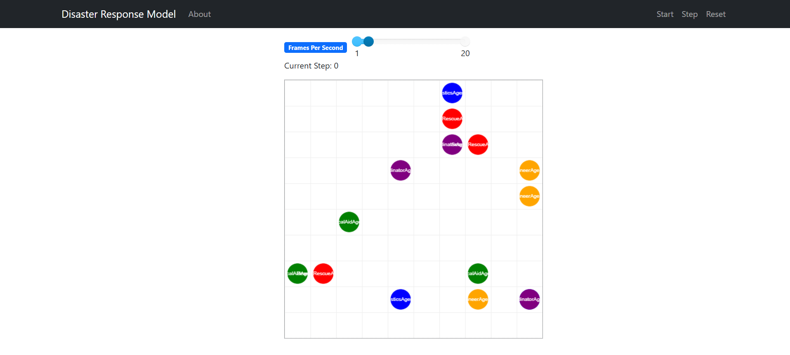

# 🧠 Disaster Response Simulation - Multi-Agent System (Mesa)



## 📝 Description

This project is a **multi-agent simulation** of disaster response operations using the **Mesa framework** in Python. It models different types of agents working together in a disaster scenario to simulate coordination, communication, and efficiency in emergency response.

### 👷‍♂️ Agent Types

- **🔴 Search & Rescue Agents**  
  Patrol the area, locate victims, and report their positions.

- **🟢 Medical Aid Agents**  
  Provide first aid to victims and can establish field hospitals.

- **🔵 Logistics Agents**  
  Deliver supplies to medical personnel and manage inventory.

- **🟠 Engineer Agents**  
  Clear debris, repair infrastructure, and build shelters.

- **🟣 Coordinator Agent**  
  Prioritizes victim locations and makes global decisions for resource allocation.

The simulation demonstrates real-time coordination between these agents on a **grid-based environment**.

---

## 📦 Requirements

- Python 3.6+
- [Mesa](https://github.com/projectmesa/mesa)

Install Mesa using pip:

```bash
pip install mesa
```

---

## ▶️ How to Run

1. **Clone this repository**:

```bash
git clone https://github.com/your-username/disaster-response-simulation.git
cd disaster-response-simulation
```

2. **Install dependencies**:

```bash
pip install mesa
```

3. **Run the simulation**:

```bash
python main.py
```

> A browser window will automatically open with a visualization of the simulation.

---

## 🎮 Simulation Controls

- **Start**: Begin the simulation
- **Step**: Advance by one simulation tick
- **Stop**: Pause the simulation
- **Reset**: Restart the simulation

---

## 🎨 Agent Colors

| Agent Type              | Color       |
|-------------------------|-------------|
| Search & Rescue Agents  | 🔴 Red       |
| Medical Aid Agents      | 🟢 Green     |
| Logistics Agents        | 🔵 Blue      |
| Engineer Agents         | 🟠 Orange    |
| Coordinator Agent       | 🟣 Purple    |
| Field Hospitals         | 🔷 Light Blue |

---

## 📤 Output

The simulation logs detailed messages to the console, including:

- Agent movements
- Victim discoveries and treatment
- Supply deliveries
- Debris clearing and shelter building
- Strategic decisions by the Coordinator

These logs help track the state and coordination between agents throughout the disaster response scenario.
